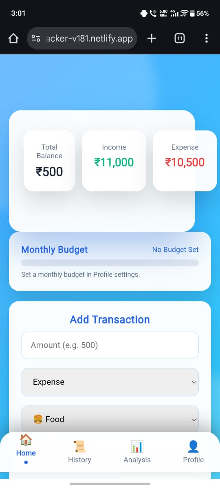
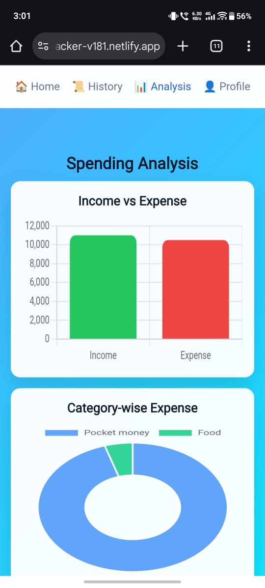
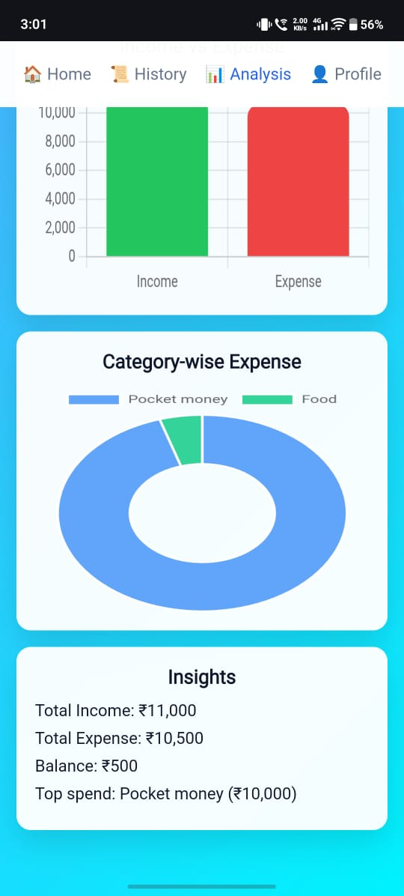
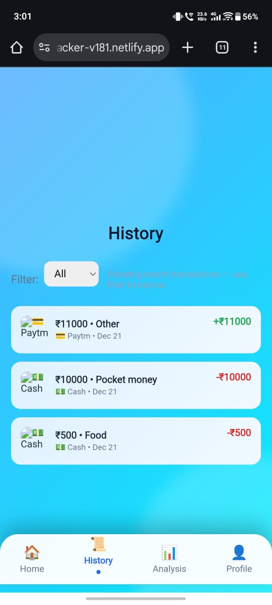
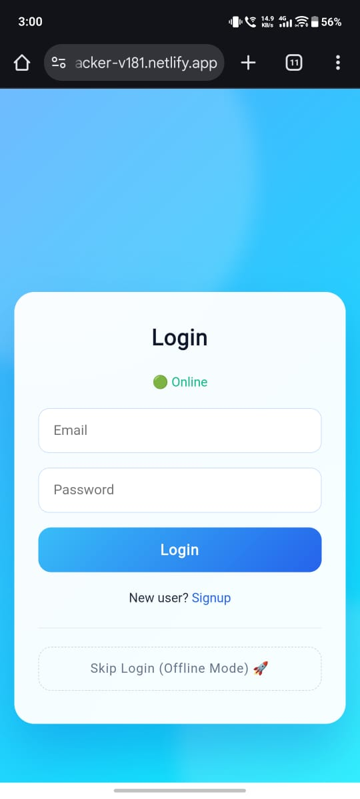
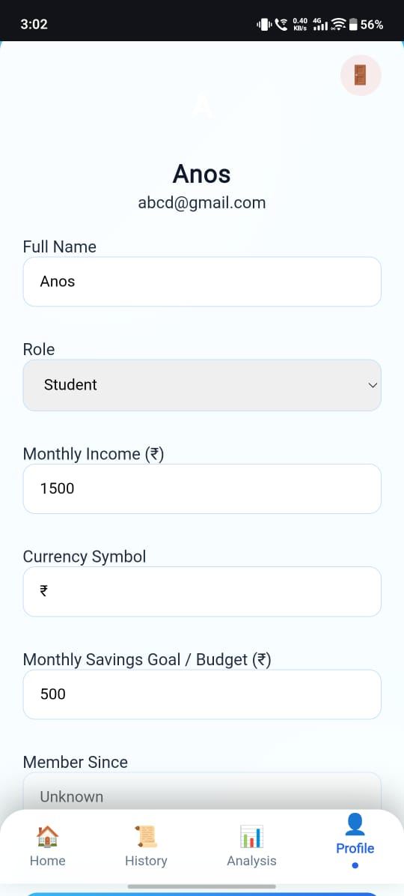

💻 Expense Tracker – Web Application

A functional Expense Tracker web application designed to manage daily expenses with dashboards, insights, and user flows.

This project focuses on real functionality, clean UI, and proof-based development — not just static pages.

🚀 Overview

The Expense Tracker Web App helps users:

Track daily expenses

View expense history

Analyze spending through charts & insights

This web version also serves as the base project for conversion into an Android app using Capacitor.

✨ Features

Add and manage daily expenses

Interactive dashboard view

Expense history tab

Charts & spending insights

User login screen

Profile screen

Clean, modular UI

🧩 Use Cases

Personal expense management

Student budgeting

Learning frontend development

Base project for web → mobile conversion

🛠 Tech Stack

HTML

CSS

JavaScript

Vite

Netlify (deployment)

▶️ Usage

Run the project locally:

npm install
npm run dev

Open in browser:

http://localhost:5173

🧪 Project Structure
assets/
auth/
css/
dashboard/
js/
public/
screenshots/

The project is structured for clarity and easy scalability.

📸 Screenshots (Web App – Real Implementation)

All screenshots are captured from the running web application
and stored in the /screenshots folder.

📊 Dashboard & Insights

    

📑 Expense History & Login

   

👤 Profile

  

✅ Why screenshots render correctly

Correct relative paths: ./screenshots/...

Exact file names (case-sensitive)

GitHub-compatible Markdown

🌐 Live Demo

🔗https://expense-tracker-v181.netlify.app

🔗 Related Project

📱 Android App (Capacitor): Expense-tacker-capacitor-app

This web project is the core codebase used for Android conversion.

🧠 What This Project Demonstrates

Real frontend implementation

Dashboard-style UI development

Data visualization basics

Modular JavaScript structure

Documentation with execution proof

🔮 Future Improvements

Firebase authentication

Cloud data sync

Expense categories

Improved analytics

UI/UX refinements

⭐ Support

If you find this project useful:

⭐ Star the repository

🍴 Fork it

💬 Share suggestions

📄 License

MIT License

👤 Author

Shreyash Mane
CSE First-Year Student
Web & App Developer

GitHub: https://github.com/shreyashmane-dev

LinkedIn: https://www.linkedin.com/in/shreyash-mane-7675a4385
